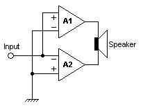
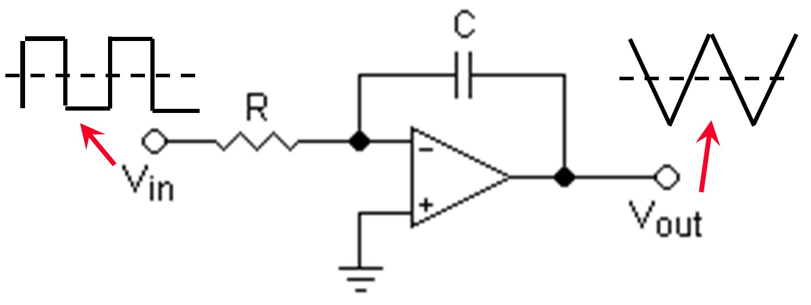

# ECEN405_ClassDAmplifier

# Parts Checklist:
- [ ] [LPF 1](#lpf-1)
- [ ] [LPF 2](#lpf-2)
- [ ] [Gate Drivers](#gate-drivers) x 2
- [ ] Triangle wave generator block 
    - [ x ] [Comparator 1](#comparator-1) 
    - [ ] [Integrator](#integrator)
- [ ] [MOSFETs](#mosfets) x 2
- [ ] [Comparator 2](#comparator) 2
- [ ] [Inverter](#inverter)
- [ ] [Buffer](#buffer)

# System Overview
## Input Voltage
2V Peak to peak (+1V to -1V) with at least 1V input sensitivity. 

## Filters
### **Output Filter**
Needs to filter frequencies above 200Hz, but not the 200Hz point such that it has equivalent gain.  
Will likely need to be a Bridge Tied load (BTL) configuration, as BTL output filters do not require DC blocking caps, which limit the low frequency response of the amplifier, and can be quite large.  
  
  

Further reading: [on output filter types for class-d amplifiers](https://www.eetimes.com/understanding-output-filters-for-class-d-amplifiers/) and [BTL configurations on Wikipedia](https://en.wikipedia.org/wiki/Bridged_and_paralleled_amplifiers#Bridge-parallel_amplifier)  

### **Input Filter**
Cut-off point at 2kHz so that the cut-off is 1 decade above the 200Hz at the top of the bandwidth. This will avoid the phase change since it starts 1 decade before the cut-off. Make a Bode plot. No HPF for input as it is not needed. 
## Triangle Wave Generator
Possible approaches:
### **555 timer and an integrator**
To produce a clean triangle wave is complicated with a 555, simpler circuits with a 555 don't seem to guarantee a good output triangle wave. Furthermore, 55 timer circuits are more expensive and have a larger footprint.

### **Comparator integrator** 
A comparator integrator, is able to provide a reliably clean triangle wave and is fairly simple to implement.  
  
The frequency of the triangle wave will be above the audible range of frequencies at 22kHz.  
The package used will be: [MAX4016](https://www.digikey.co.nz/product-detail/en/maxim-integrated/MAX4016ESA/MAX4016ESA-ND/1702288)  
- 10V rail so that we don’t step down more again
- 5V middle because 50/50 v-divider is easy
- No dual rail because that is what a full bridge is for
- Also no whack shit - Danny B

## Switching Frequency
Two key constraints with switching frequency:  
1. As we are sampling an audio signal, it must be at least 10x the max frequency in our signal. The max signal frequency for the amplifier will be 200Hz, therefore the minimum sampling frequency must be 2kHz.
2. The switching frequency can't be audible, which means it must be outside of the audible range of frequencies to humans which is 20Hz - 20kHz. Adult humans typically can't hear more than 15 - 17kHz, making 20kHz a reasonable limit.
As a result the switching frequency must be **at least 20kHz**.

# Part Description and Justification
## LPF 1
## LPF 2
## Gate Drivers
### Requirements
- 18V Input
- 80W at 4 Ohms
- No integrated Fets
- Selectable Dead Time

### Selected
## Comparator 1
[MAX4016](https://www.digikey.co.nz/product-detail/en/maxim-integrated/MAX4016ESA/MAX4016ESA-ND/1702288)  
- 10V rail so that we don’t step down more again
- 5V middle because 50/50 v-divider is easy
- No dual rail because that is what a full bridge is for
- Also no whack shit - Danny B
## Integrator
## MOSFETs
## Comparator 2
## Inverter
## Buffer
